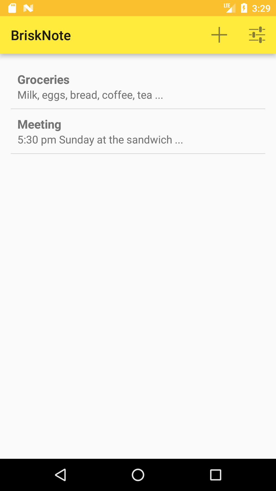

# BriskNote
My final project is BriskNote, a simple notepad for Android. It stores simple and quick notes using a minimal UI. Tapping a note will open it, and holding it will delete it, and the app can be configured to start in a new note instead of the list. Inspired by the core functionality of Google Keep.

