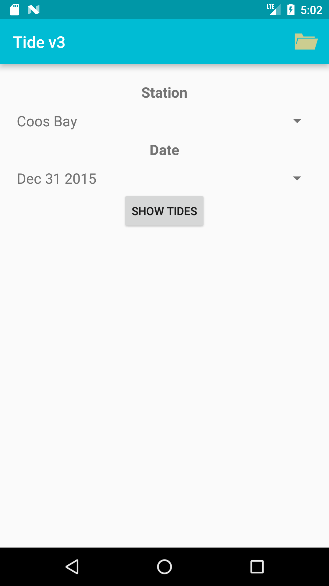

# Tide v3

    
    This version of the Tide app uses asynchronous SOAP requests to collect data about tidal information. Recently viewed tables are stored on the device for offline use. <i>This app is still a work in progress!</i> The UI should be updated to reflect these changes. 

